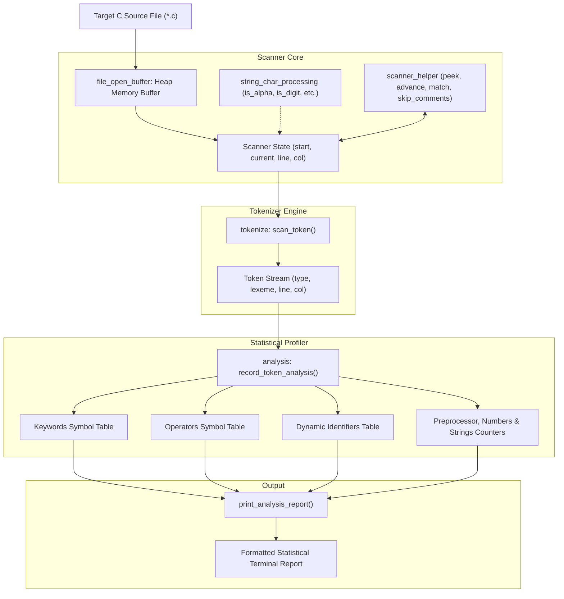

# Modular Scanner & Lexical Statistical Analyzer: Architecture, Design & Implementation

This document provides a comprehensive technical reference for the modular lexical scanner and statistical analyzer designed for C source code. It documents the design philosophy, pipeline architecture, individual component implementations, data structures, and grammar rules.

---

## Table of Contents

1. [Executive Summary & Design Philosophy](#1-executive-summary--design-philosophy)
2. [System Architecture & Pipeline](#2-system-architecture--pipeline)
3. [Step-by-Step Component Breakdown](#3-step-by-step-component-breakdown)
   - [3.1. Layer 1: File Buffer Loading](#31-layer-1-file-buffer-loading)
   - [3.2. Layer 2: Character Classification](#32-layer-2-character-classification)
   - [3.3. Layer 3: Scanner Core & Lookahead](#33-layer-3-scanner-core--lookahead)
   - [3.4. Layer 4: Token Definitions & Tokenization Engine](#34-layer-4-token-definitions--tokenization-engine)
   - [3.5. Layer 5: Statistical Profiling Engine](#35-layer-5-statistical-profiling-engine)
   - [3.6. Layer 6: Driver CLI & Build System](#36-layer-6-driver-cli--build-system)
4. [Data Structures & Symbol Tables](#4-data-structures--symbol-tables)
5. [Lexical Grammar & Scanning Rules](#5-lexical-grammar--scanning-rules)
6. [Sample Input & Output Trace](#6-sample-input--output-trace)
7. [Architectural Comparison: Monolithic vs. Modular](#7-architectural-comparison-monolithic-vs-modular)

---

## 1. Executive Summary & Design Philosophy

The lexical analysis and statistical profiler analyzes C source code by performing single-pass lexical scanning, classifying tokens into syntactic categories, capturing exact line occurrence locations, and generating aggregated metrics.

### Key Goals of the Modular Architecture
- **Single Responsibility Principle**: Each component does exactly one job (file reading, character predicates, cursor tracking, token creation, or statistical aggregation).
- **Decoupled Headers (`.h`)**: Modules interact exclusively through clean C headers, avoiding circular dependencies and `#include "...c"` anti-patterns.
- **Zero-Copy Lexeme Representation**: Tokens reference memory slices directly within the loaded source buffer (`start` pointer + `length`), avoiding unnecessary heap allocations.
- **Robust Comment & Whitespace Handling**: Fully handles single-line comments (`// ...`) and multi-line block comments (`/* ... */`) with exact line and column tracking.

---

## 2. System Architecture & Pipeline



---

## 3. Step-by-Step Component Breakdown

### 3.1. Layer 1: File Buffer Loading
- **Files**: [`file_open_buffer.h`](file:///home/shanku/Public/mscode/compiler/analysing/file_open_buffer.h), [`file_open_buffer.c`](file:///home/shanku/Public/mscode/compiler/analysing/file_open_buffer.c)
- **Function**: `char *read_file_ret_char_buffer(const char *filename)`
- **Design Idea**: Reads the entire file into a single contiguous block of heap memory using `fseek()` and `fread()`, null-terminating the end (`\0`). This eliminates line length limits and allows instant lookahead across line boundaries.

### 3.2. Layer 2: Character Classification
- **Files**: [`string_char_processing.h`](file:///home/shanku/Public/mscode/compiler/analysing/string_char_processing.h), [`string_char_processing.c`](file:///home/shanku/Public/mscode/compiler/analysing/string_char_processing.c)
- **Predicates**:
  - `is_alphabet(char c)`: Checks `[a-zA-Z_]` (includes underscores for C identifiers).
  - `is_digit(char c)`: Checks `[0-9]`.
  - `is_alphanumeric(char c)`: Checks `is_alphabet || is_digit`.
  - `is_whitespace(char c)`: Checks space `' '`, carriage return `'\r'`, horizontal tab `'\t'`.
  - `is_newline(char c)`: Checks newline `'\n'`.
  - `is_operator_char(char c)`: Checks `+`, `-`, `*`, `/`, `=`, `<`, `>`, `!`, `&`, `|`, `%`, `^`.
  - `is_delimiter_char(char c)`: Checks `(`, `)`, `{`, `}`, `[`, `]`, `,`, `;`, `:`, `.`.

### 3.3. Layer 3: Scanner Core & Lookahead
- **Files**: [`scanner_helper.h`](file:///home/shanku/Public/mscode/compiler/analysing/scanner_helper.h), [`scanner_helper.c`](file:///home/shanku/Public/mscode/compiler/analysing/scanner_helper.c)
- **Functions**:
  - `init_scanner(Scanner *s, const char *source)`: Initializes cursor to buffer start at line 1, column 1.
  - `peek_current_char(const Scanner *s)`: Returns current character without advancing (Lookahead-0).
  - `peek_next_char(const Scanner *s)`: Returns next character without advancing (Lookahead-1).
  - `advance_char(Scanner *s)`: Consumes character, tracks column, and increments line number on `\n`.
  - `match_char(Scanner *s, char expected)`: Conditional consumer: advances only if current character equals `expected`.
  - `skip_whitespace_and_comments(Scanner *s)`: Skips whitespace and consumes both `// single line` and `/* multi-line */` comments.

### 3.4. Layer 4: Token Definitions & Tokenization Engine
- **Files**: [`token.h`](file:///home/shanku/Public/mscode/compiler/analysing/token.h), [`tokenize.h`](file:///home/shanku/Public/mscode/compiler/analysing/tokenize.h), [`tokenize.c`](file:///home/shanku/Public/mscode/compiler/analysing/tokenize.c)
- **Functions**:
  - `Token scan_token(Scanner *scanner)`: Consumes characters from the scanner state and produces the next discrete `Token`.
  - `const char *token_type_to_string(TokenType type)`: Converts enum values to human-readable strings.
  - `void print_token(const Token *token)`: Prints formatted token information with line and column.

### 3.5. Layer 5: Statistical Profiling Engine
- **Files**: [`analysis.h`](file:///home/shanku/Public/mscode/compiler/analysing/analysis.h), [`analysis.c`](file:///home/shanku/Public/mscode/compiler/analysing/analysis.c)
- **Functions**:
  - `init_analysis(AnalysisStats *stats)`: Initializes symbol tables with standard 14 keywords and 17 operators.
  - `record_token_analysis(AnalysisStats *stats, const Token *token)`: Routes each token to its category table, updating frequencies and recording line occurrence numbers.
  - `run_analysis_on_source(AnalysisStats *stats, const char *source)`: Runs full lexical analysis pass over source buffer.
  - `print_analysis_report(const AnalysisStats *stats)`: Outputs the formatted report with line number breakdowns.

### 3.6. Layer 6: Driver CLI & Build System
- **Files**: [`main.c`](file:///home/shanku/Public/mscode/compiler/analysing/main.c), [`Makefile`](file:///home/shanku/Public/mscode/compiler/analysing/Makefile)
- **Workflow**:
  1. Accepts source path from `argv[1]` (defaults to `file.txt`).
  2. Loads file into buffer via `read_file_ret_char_buffer()`.
  3. Displays complete token stream.
  4. Computes and displays the statistical lexical report.
  5. Cleans up memory.

---

## 4. Data Structures & Symbol Tables

### 4.1. Scanner State (`Scanner`)
```c
typedef struct
{
    const char *start;    // Start pointer of the current token
    const char *current;  // Current lookahead reading pointer
    int line;             // 1-based source line number
    int column;           // 1-based source column number
} Scanner;
```

### 4.2. Token Structure (`Token`)
```c
typedef struct
{
    TokenType type;       // Syntactic classification
    const char *start;    // Pointer to token lexeme in source buffer
    int length;           // Number of characters in lexeme
    int line;             // Line where token appeared
    int column;           // Column where token started
} Token;
```

### 4.3. Statistical Metadata Structure (`TokenStat`)
```c
typedef struct
{
    char name[64];              // Lexeme string representation
    int frequency;              // Total occurrence count
    int lines[MAX_TRACKED_LINES]; // Array of line numbers where token appeared
    int numberOfLines;          // Count of recorded line entries
} TokenStat;
```

### 4.4. Aggregated Statistics Container (`AnalysisStats`)
```c
typedef struct
{
    TokenStat keywords[14];
    int keywordCount;

    TokenStat operators[17];
    int operatorCount;

    TokenStat identifiers[MAX_IDENTIFIERS];
    int identifierCount;

    int preprocessorCount;
    int constantCount;
    int stringCount;
    int totalTokens;
} AnalysisStats;
```

---

## 5. Lexical Grammar & Scanning Rules

```
+--------------------------+-----------------------------------+-----------------------------------+
| Category                 | Pattern / Rule                    | Example Matches                   |
+--------------------------+-----------------------------------+-----------------------------------+
| Preprocessor Directive   | '#' [^\n]*                        | #include <stdio.h>, #define MAX 10|
| Keyword                  | Exact match against 14 keywords   | int, float, if, while, return     |
| Identifier               | [a-zA-Z_][a-zA-Z0-9_]*            | main, sum, counter, _ptr          |
| Numeric Constant         | [0-9]+ ('.' [0-9]+)?              | 0, 10, 42, 3.1415                 |
| String Literal           | '"' ([^"\\] | '\\' .)* '"'        | "hello", "Result: %d\n"           |
| Character Literal        | '\'' ([^'\\] | '\\' .)* '\''      | 'a', '\n'                         |
| Compound Operator        | ++, --, +=, -=, ==, !=, &&, ||,   | ++, <=, &&, +=                    |
|                          | <=, >=                            |                                   |
| Single Operator          | +, -, *, /, =, <, >               | +, *, =                           |
| Delimiters               | (, ), {, }, [, ], ,, ;            | (, ), {, }, ;                     |
+--------------------------+-----------------------------------+-----------------------------------+
```

---

## 6. Sample Input & Output Trace

### 6.1. Sample Program (`test_sample.c`)
```c
#include <stdio.h>

// This is a single line comment
/*
   Multi-line block comment
   to test comment skipping
*/
int main()
{
    int a = 10;
    int b = 20;
    float sum = 0.0;

    if (a < b && b != 0)
    {
        a++;
        b -= 5;
        sum += a * b;
    }

    printf("Result sum: %f\n", sum);
    return 0;
}
```

### 6.2. Generated Token Stream
```
[Line  1, Col  1] PREPROCESSOR       '#include <stdio.h>'
[Line  8, Col  1] KEYWORD_INT        'int'
[Line  8, Col  5] IDENTIFIER         'main'
[Line  8, Col  9] DELIM_LPAREN       '('
[Line  8, Col 10] DELIM_RPAREN       ')'
[Line  9, Col  1] DELIM_LBRACE       '{'
[Line 10, Col  5] KEYWORD_INT        'int'
[Line 10, Col  9] IDENTIFIER         'a'
[Line 10, Col 11] OP_EQUAL           '='
[Line 10, Col 13] NUMBER             '10'
[Line 10, Col 15] DELIM_SEMICOLON    ';'
[Line 11, Col  5] KEYWORD_INT        'int'
[Line 11, Col  9] IDENTIFIER         'b'
[Line 11, Col 11] OP_EQUAL           '='
[Line 11, Col 13] NUMBER             '20'
[Line 11, Col 15] DELIM_SEMICOLON    ';'
[Line 12, Col  5] KEYWORD_FLOAT      'float'
[Line 12, Col 11] IDENTIFIER         'sum'
[Line 12, Col 15] OP_EQUAL           '='
[Line 12, Col 17] NUMBER             '0.0'
[Line 12, Col 20] DELIM_SEMICOLON    ';'
[Line 14, Col  5] KEYWORD_IF         'if'
[Line 14, Col  8] DELIM_LPAREN       '('
[Line 14, Col  9] IDENTIFIER         'a'
[Line 14, Col 11] OP_LESS            '<'
[Line 14, Col 13] IDENTIFIER         'b'
[Line 14, Col 15] OP_AND_AND         '&&'
[Line 14, Col 18] IDENTIFIER         'b'
[Line 14, Col 20] OP_BANG_EQUAL      '!='
[Line 14, Col 23] NUMBER             '0'
[Line 14, Col 24] DELIM_RPAREN       ')'
[Line 15, Col  5] DELIM_LBRACE       '{'
[Line 16, Col  9] IDENTIFIER         'a'
[Line 16, Col 10] OP_PLUS_PLUS       '++'
[Line 16, Col 12] DELIM_SEMICOLON    ';'
[Line 17, Col  9] IDENTIFIER         'b'
[Line 17, Col 11] OP_MINUS_EQUAL     '-='
[Line 17, Col 14] NUMBER             '5'
[Line 17, Col 15] DELIM_SEMICOLON    ';'
[Line 18, Col  9] IDENTIFIER         'sum'
[Line 18, Col 13] OP_PLUS_EQUAL      '+='
[Line 18, Col 16] IDENTIFIER         'a'
[Line 18, Col 18] OP_STAR            '*'
[Line 18, Col 20] IDENTIFIER         'b'
[Line 18, Col 21] DELIM_SEMICOLON    ';'
[Line 19, Col  5] DELIM_RBRACE       '}'
[Line 21, Col  5] IDENTIFIER         'printf'
[Line 21, Col 11] DELIM_LPAREN       '('
[Line 21, Col 12] STRING             '"Result sum: %f\n"'
[Line 21, Col 30] DELIM_COMMA        ','
[Line 21, Col 32] IDENTIFIER         'sum'
[Line 21, Col 35] DELIM_RPAREN       ')'
[Line 21, Col 36] DELIM_SEMICOLON    ';'
[Line 22, Col  5] KEYWORD_RETURN     'return'
[Line 22, Col 12] NUMBER             '0'
[Line 22, Col 13] DELIM_SEMICOLON    ';'
[Line 23, Col  1] DELIM_RBRACE       '}'
[Line 24, Col  1] EOF                ''
```

### 6.3. Generated Statistical Report
```
======================================================
                LEXICAL ANALYSIS REPORT               
======================================================

--- Keywords Frequency ---
  int          | Count: 3    | Lines: 8, 10, 11
  float        | Count: 1    | Lines: 12
  if           | Count: 1    | Lines: 14
  return       | Count: 1    | Lines: 22
  Total Keywords: 6

--- Operators Frequency ---
  ++           | Count: 1    | Lines: 16
  *            | Count: 1    | Lines: 18
  +=           | Count: 1    | Lines: 18
  -=           | Count: 1    | Lines: 17
  =            | Count: 3    | Lines: 10, 11, 12
  !=           | Count: 1    | Lines: 14
  &&           | Count: 1    | Lines: 14
  <            | Count: 1    | Lines: 14
  Total Operators: 10

--- Identifiers Frequency ---
  main         | Count: 1    | Lines: 8
  a            | Count: 4    | Lines: 10, 14, 16, 18
  b            | Count: 5    | Lines: 11, 14, 14, 17, 18
  sum          | Count: 3    | Lines: 12, 18, 21
  printf       | Count: 1    | Lines: 21
  Total Identifiers: 14 (Unique: 5)

--- Additional Metrics ---
  Preprocessor Directives : 1
  Numeric Constants       : 6
  String Literals         : 1
  Total Tokens Processed  : 57
======================================================
```

---

## 7. Architectural Comparison: Monolithic vs. Modular

| Dimension | Monolithic (`analysis_program.c`) | Modular Pipeline Architecture |
| :--- | :--- | :--- |
| **Code Organization** | 430 lines in single file with nested conditionals | 6 decoupled modules with clear header interfaces |
| **Input Source** | Line-by-line buffer with fixed 100-byte limit | Whole-file memory buffer (no arbitrary line length limit) |
| **Token Representation** | Ad-hoc character arrays copied on each match | Structured `Token` (`type`, `start`, `length`, `line`, `col`) |
| **Lookahead & Lexing** | Implicit two-char transition tracking (`past` & `p[0]`) | Formal scanner functions (`peek`, `peek_next`, `advance`, `match`) |
| **Comment Support** | None (comments could be parsed as tokens) | Full single-line (`//`) and multi-line (`/* */`) skipping |
| **Number Parsing** | Incremented counter per single digit character | Aggregated integer and floating-point number tokens |
| **Maintainability** | Hard to extend or plug into a parser | Readily reusable for downstream parsing (AST / syntax tree) |
