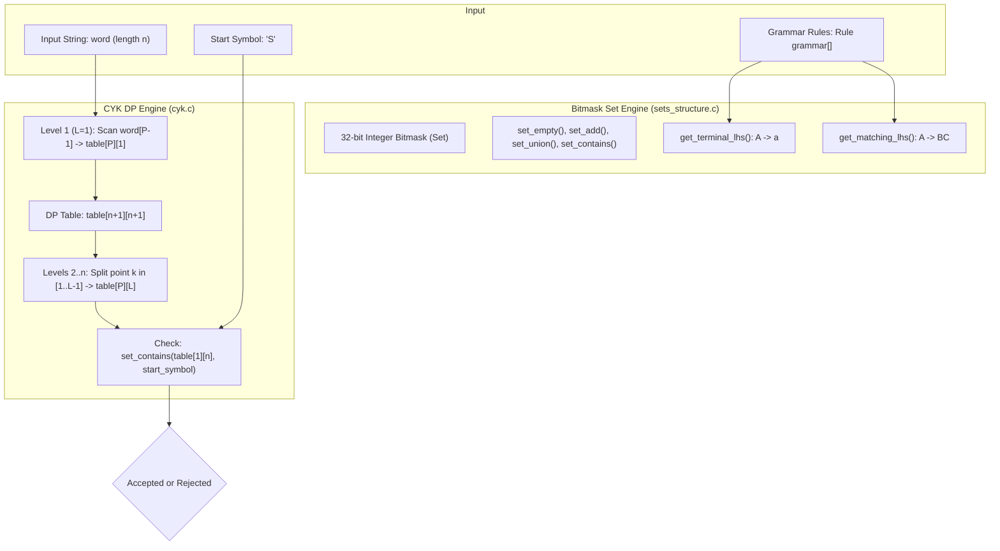
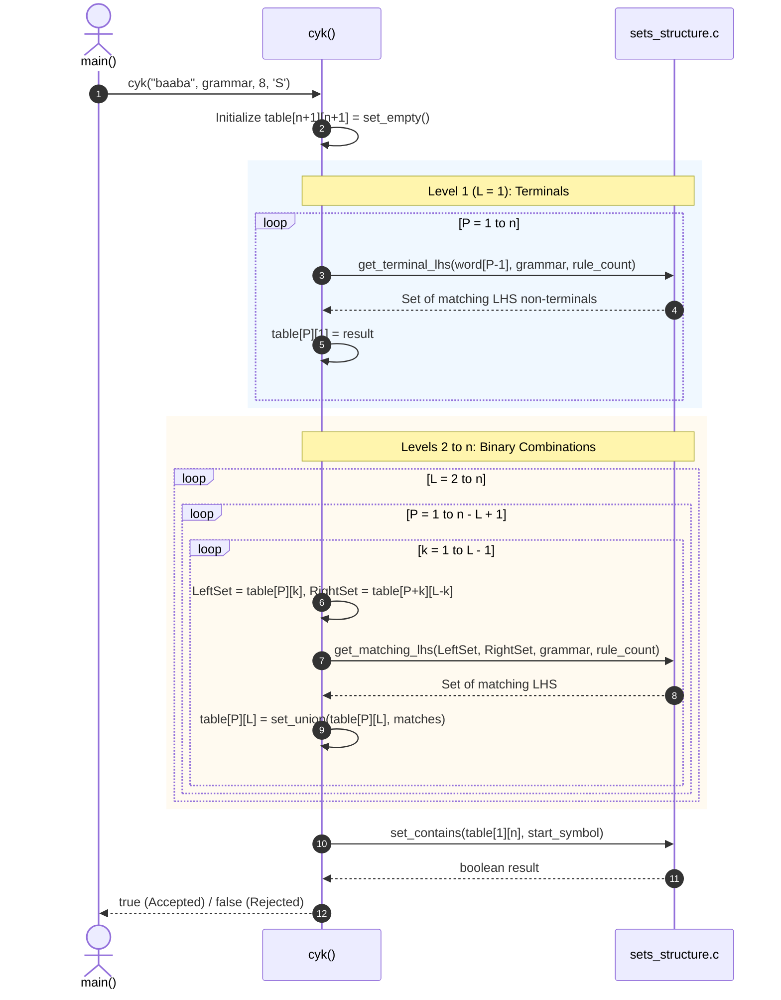

# Cocke-Younger-Kasami (CYK) Algorithm: Design & Code Documentation

This document provides a comprehensive architectural design, theoretical foundation, data structure specification, and code documentation for the C implementation of the **Cocke-Younger-Kasami (CYK) Algorithm** located in [`cyk_algo/`](file:///home/shanku/Public/mscode/compiler/cyk_algo).

---

## Table of Contents

1. [Overview & Background](#1-overview--background)
2. [Grammar Formalism (Chomsky Normal Form)](#2-grammar-formalism-chomsky-normal-form)
3. [System Architecture & Design](#3-system-architecture--design)
4. [Data Structures & Bitmask Sets](#4-data-structures--bitmask-sets)
5. [Dynamic Programming Recurrence & DP Table](#5-dynamic-programming-recurrence--dp-table)
6. [Detailed Algorithm Walkthrough](#6-detailed-algorithm-walkthrough)
7. [Complexity Analysis](#7-complexity-analysis)
8. [API & Function Reference](#8-api--function-reference)
9. [Build, Run & Verification Guide](#9-build-run--verification-guide)

---

## 1. Overview & Background

The **Cocke-Younger-Kasami (CYK)** algorithm is a bottom-up dynamic programming parsing algorithm for Context-Free Grammars (CFGs). Given a formal grammar $G$ in **Chomsky Normal Form (CNF)** and an input string $w$ of length $n$, the algorithm determines whether $w \in L(G)$ in $O(n^3 \cdot |G|)$ time.

### Core Source Files

- **[`sets_structure.c`](file:///home/shanku/Public/mscode/compiler/cyk_algo/sets_structure.c)**: Defines the grammar data structures (`Rule`), efficient bitmask-based set representations (`Set`), set operators, and grammar rule matching routines (`get_terminal_lhs`, `get_matching_lhs`).
- **[`cyk.c`](file:///home/shanku/Public/mscode/compiler/cyk_algo/cyk.c)**: Contains the main CYK table-filling algorithm (`cyk`), table printing functions, and the test driver (`main`).

---

## 2. Grammar Formalism (Chomsky Normal Form)

The CYK algorithm requires the context-free grammar to be in **Chomsky Normal Form (CNF)**, where every production rule takes one of two shapes:

1. **Terminal Rules**: $A \to a$
   - Left-Hand Side (LHS): A single non-terminal ($A \in V_N$)
   - Right-Hand Side (RHS): A single terminal ($a \in \Sigma$)
2. **Binary Non-Terminal Rules**: $A \to BC$
   - Left-Hand Side (LHS): A single non-terminal ($A \in V_N$)
   - Right-Hand Side (RHS): Exactly two non-terminals ($B, C \in V_N$)

```
+-------------------------------------------------------------+
| Production Type | Syntax in Code    | Example               |
+-----------------+-------------------+-----------------------+
| Binary Rule     | {'S', "AB"}       | S -> AB               |
| Terminal Rule   | {'A', "a"}        | A -> a                |
+-------------------------------------------------------------+
```

---

## 3. System Architecture & Design



---

## 4. Data Structures & Bitmask Sets

### 4.1. Grammar Rule Representation

A rule is defined as a fixed-size C struct:

```c
typedef struct
{
    char left;      // LHS non-terminal ('A'..'Z')
    char right[3];  // RHS string: "a" (terminal) or "AB" (binary non-terminals)
} Rule;
```

### 4.2. Bitmask Set Implementation

Instead of dynamic allocations or linked lists, a mathematical set of non-terminals ($V_N \subseteq \{'A', \dots, 'Z'\}$) is encoded as a **32-bit unsigned integer bitmask**:

$$\text{Bit } i = (\text{non\_term} - \text{'A'})$$

- `'A'` corresponds to Bit 0 ($2^0$)
- `'B'` corresponds to Bit 1 ($2^1$)
- `'Z'` corresponds to Bit 25 ($2^{25}$)

```
Bit:   ... 5   4   3   2   1   0
Char:  ... F   E   D   C   B   A
Value: ... 0   0   0   0   1   1  => Set containing { 'A', 'B' }
```

#### Set Operations Complexity

| Operation | C Implementation | Time Complexity | Space Complexity |
| :--- | :--- | :--- | :--- |
| **Empty Set** | `0` | $O(1)$ | $O(1)$ |
| **Add Element** | `s | (1U << (c - 'A'))` | $O(1)$ | $O(1)$ |
| **Contains Element** | `(s & (1U << (c - 'A'))) != 0` | $O(1)$ | $O(1)$ |
| **Union of Two Sets** | `s1 | s2` | $O(1)$ | $O(1)$ |

---

## 5. Dynamic Programming Recurrence & DP Table

### 5.1. Table Indexing Convention

The parse table uses **1-based indexing** parameterized by **(Position, Length)**:

$$\text{table}[P][L]$$

- $P \in [1, n]$: 1-based start index of the substring within $w$.
- $L \in [1, n]$: Length of the substring.
- Substring represented: $w[P-1 \dots P-1+L-1]$.

```
Pyramid / Parse Table View (for n = 5, "baaba"):

Level 5 (L=5):  T[1][5]
Level 4 (L=4):  T[1][4]  T[2][4]
Level 3 (L=3):  T[1][3]  T[2][3]  T[3][3]
Level 2 (L=2):  T[1][2]  T[2][2]  T[3][2]  T[4][2]
Level 1 (L=1):  T[1][1]  T[2][1]  T[3][1]  T[4][1]  T[5][1]
                 w[0]='b' w[1]='a' w[2]='a' w[3]='b' w[4]='a'
```

### 5.2. Mathematical Recurrence

1. **Base Case ($L = 1$)**:
   $$\text{table}[P][1] = \{ A \in V_N \mid (A \to w[P-1]) \in G \}$$

2. **Inductive Step ($L \ge 2$)**:
   For any split point $k \in \{1, 2, \dots, L-1\}$:
   $$\text{LeftSet} = \text{table}[P][k]$$
   $$\text{RightSet} = \text{table}[P + k][L - k]$$
   $$\text{table}[P][L] = \bigcup_{k=1}^{L-1} \{ A \in V_N \mid (A \to BC) \in G \text{ where } B \in \text{LeftSet} \land C \in \text{RightSet} \}$$

3. **Acceptance Condition**:
   $$w \in L(G) \iff \text{start\_symbol} \in \text{table}[1][n]$$

---

## 6. Detailed Algorithm Walkthrough



---

## 7. Complexity Analysis

### Time Complexity

- **Base Case (Level 1)**:
  - Iterates $n$ positions.
  - Inspects $|R|$ grammar rules.
  - $\text{Time} = O(n \cdot |R|)$.
- **Pyramid Building (Levels 2 to $n$)**:
  - Length loop runs $n-1$ times: $L \in [2, n]$.
  - Position loop runs $n - L + 1$ times.
  - Split point loop runs $L - 1$ times.
  - Number of split evaluations: $\sum_{L=2}^n (n - L + 1)(L - 1) = \frac{n^3 - n}{6} \implies O(n^3)$.
  - For each split, `get_matching_lhs` inspects $|R|$ rules with $O(1)$ bit checks.
  - $\text{Time} = O(n^3 \cdot |R|)$.
- **Total Time Complexity**: $\mathcal{O}(n^3 \cdot |R|)$.

### Space Complexity

- **Parse Table**: `table[n+1][n+1]` of 32-bit integers (`Set`).
- **Memory Allocated**: $(n + 1)^2 \times 4\text{ bytes}$.
- **Total Auxiliary Space**: $\mathcal{O}(n^2)$.

---

## 8. API & Function Reference

### 8.1. `sets_structure.c`

#### `set_empty`

```c
static inline Set set_empty(void);
```

- **Description**: Returns an empty set (0 bitmask).

#### `set_add`

```c
static inline Set set_add(Set s, char non_term);
```

- **Parameters**: `s` (current set), `non_term` (uppercase letter `'A'`..`'Z'`).
- **Returns**: A new `Set` containing `non_term`.

#### `set_contains`

```c
static inline bool set_contains(Set s, char non_term);
```

- **Parameters**: `s` (set to test), `non_term` (character).
- **Returns**: `true` if `non_term` is in `s`, otherwise `false`.

#### `set_union`

```c
static inline Set set_union(Set s1, Set s2);
```

- **Parameters**: `s1`, `s2` (sets to combine).
- **Returns**: Bitwise OR union of both sets.

#### `get_terminal_lhs`

```c
Set get_terminal_lhs(char terminal, const Rule grammar[], int rule_count);
```

- **Parameters**:
  - `terminal`: Target terminal character (e.g. `'a'`).
  - `grammar`: Array of `Rule` structures.
  - `rule_count`: Total number of rules in `grammar`.
- **Returns**: `Set` of all non-terminals $A$ where $A \to \text{terminal}$.

#### `get_matching_lhs`

```c
Set get_matching_lhs(Set left_set, Set right_set, const Rule grammar[], int rule_count);
```

- **Parameters**:
  - `left_set`: Set of non-terminals deriving left substring.
  - `right_set`: Set of non-terminals deriving right substring.
  - `grammar`: Array of `Rule` structures.
  - `rule_count`: Number of rules.
- **Returns**: `Set` of all non-terminals $A$ such that $A \to BC$ with $B \in \text{left\_set}$ and $C \in \text{right\_set}$.

---

### 8.2. `cyk.c`

#### `cyk`

```c
bool cyk(const char *word, const Rule grammar[], int rule_count, char start_symbol);
```

- **Parameters**:
  - `word`: The input string to parse.
  - `grammar`: The CNF grammar rules array.
  - `rule_count`: Number of rules in `grammar`.
  - `start_symbol`: Grammar start symbol (e.g. `'S'`).
- **Returns**: `true` if `word` can be generated by `grammar`, `false` otherwise.

---

## 9. Build, Run & Verification Guide

### Compilation

Compile with standard GCC/Clang flags:

```bash
gcc -Wall -Wextra -O2 cyk_algo/cyk.c -o cyk_algo/cyk
```

### Execution

```bash
./cyk_algo/cyk
```

### Sample Output

For grammar:

- $S \to AB \mid BC$
- $A \to BA \mid a$
- $B \to CC \mid b$
- $C \to AB \mid a$

and target input string `"baaba"` ($N = 5$):

```text
Testing word: "baaba"

CYK Parse Table (Position, Length):
Level 5 (L=5): T[1][5]={ A C S }  
Level 4 (L=4): T[1][4]={ }  T[2][4]={ A C S }  
Level 3 (L=3): T[1][3]={ }  T[2][3]={ B }  T[3][3]={ B }  
Level 2 (L=2): T[1][2]={ A S }  T[2][2]={ B }  T[3][2]={ C S }  T[4][2]={ A S }  
Level 1 (L=1): T[1][1]={ B }  T[2][1]={ A C }  T[3][1]={ A C }  T[4][1]={ B }  T[5][1]={ A C }  

Result: Word "baaba" is ACCEPTED by the grammar.
```
